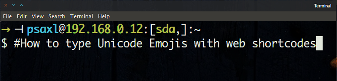

Type Unicode Emoji in Linux
===========================

> An input method based on [`m17n` library](http://www.nongnu.org/m17n) to type [Unicode Emoji](http://apps.timwhitlock.info/emoji/tables/unicode) with [shortnames](http://www.emoji-cheat-sheet.com)
> Now, you can easily type Unicode Emoji in **any** Linux apps you want (e.g. emails, browser, text editor, terminal emulator...) :grimacing:

For more shortnames: [www.emoji-cheat-sheet.com](http://www.emoji-cheat-sheet.com)

Requirements
------------
- An input method framework like [IBus](https://github.com/ibus/ibus/wiki)
  1. Install packages: `ibus`, `ibus-m17n` and `im-config`
  2. Launch `im-config` to set system input method to `ibus`
- Fonts for Unicode Emojis in `ttf-ancient-fonts-symbola` package

Install
-------

### Linux (generic, from source)
1. Clone this repository
2. Install the custom input method : `sudo make install`

### ArchLinux
1. Install the [m17n-im-shortname-unicode-emoji-git] package from [AUR]
2. If you are using non-US layout, you'll also need to install [ibus-m17n-git]
   (see [arch-ibus-non-us]).

For example, with [Yaourt]

    yaourt -S m17n-im-shortname-unicode-emoji-git ibus-m17n-git

Configuration
-------------

### Linux (generic)
1. Restart the ibus daemon: `make restart` (from source) or run `ibus-daemon -xrd`
2. Launch `ibus-setup` then add the`shortname-unicode-emoji (m17n)` input method

### GNOME 3
From [arch-ibus-gnome]:

1. Go to the _Region & Language_ settings panel
2. Select _+_ under _Input Sources_
3. Add _Other (shortcode-unicode-emoji (m17n))_

You can then switch to the input source with `Super`+`space`.

Example
-------
Typing `:smile:` will directly be substituted by Unicode symbol `😅` (U+1F604).

[m17n-im-shortname-unicode-emoji-git]: https://aur.archlinux.org/packages/m17n-im-shortname-unicode-emoji-git/
[AUR]: https://aur.archlinux.org/
[ibus-m17n-git]: https://aur.archlinux.org/packages/ibus-m17n-git/
[arch-ibus-non-us]: https://wiki.archlinux.org/index.php/IBus#Non_US_keyboards
[Yaourt]: https://archlinux.fr/yaourt-en
[arch-ibus-gnome]: https://wiki.archlinux.org/index.php/IBus#GNOME
